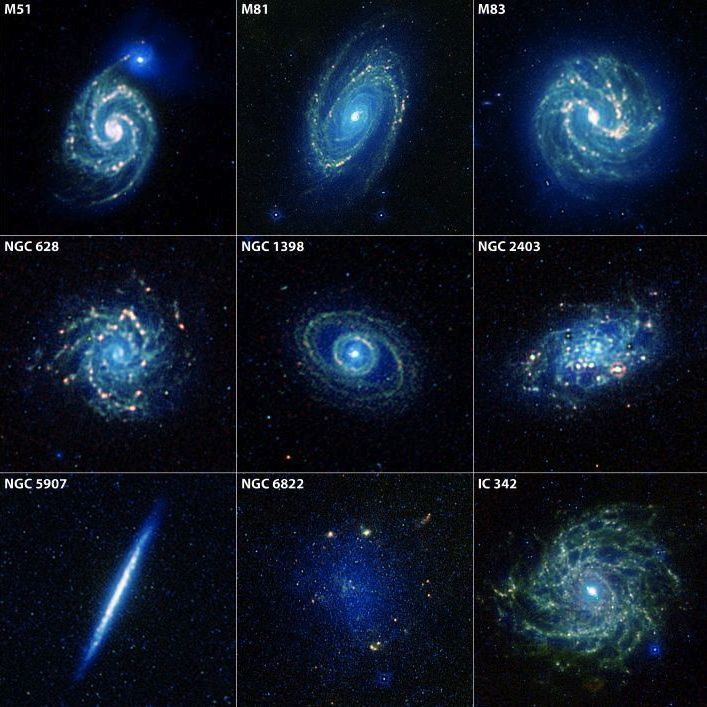
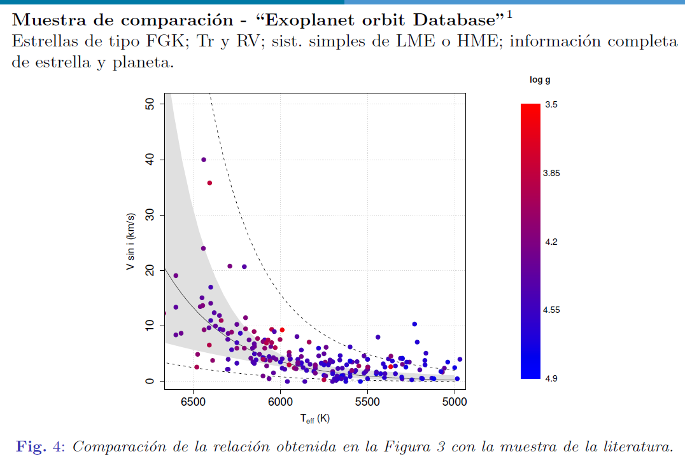
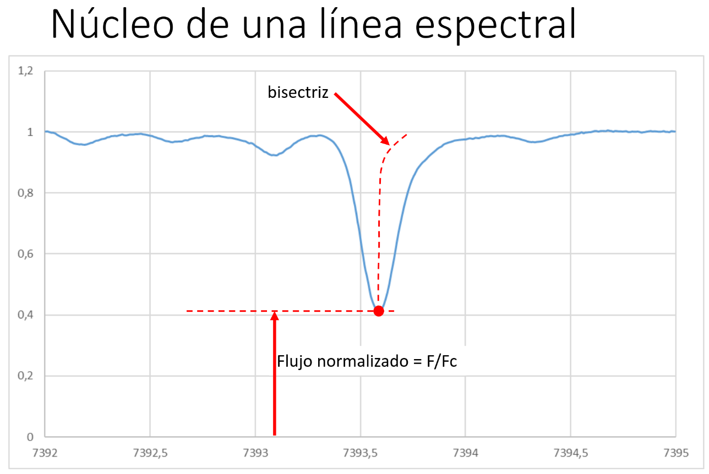

Bienvenidos a la página de los seminarios de Astronomía que tienen lugar en el Departamento de Física de la Universidad de los Andes, Bogotá-Colombia.

As  Stephen Hawking said:

>                   
>                   “Not only is it important to ask questions and find the answers, 
>          as a scientist I felt obligated to communicate with the world what we were learning.”
>          

# Histórico de Seminarios Segundo semestre de 2021

  
### Jueves Septiembre-16-2021:

- **Lady Johana Henao Ocampo** (Doctorante en Ciencias Físicas del Departamento de Astronomía de la Universidad de Concepción en Chile). **Cúmulos Globulares en la Arqueología Galáctica)** 

*Los Cúmulos Globulares (GCs) son excelentes trazadores de la evolución galáctica, ya que son objetos muy brillantes y son tan antiguos como la galaxia misma, con edades superiores a 12 Gyrs. Con técnicas de espectroscopía en el Infrarrojo cercano (1.5 -1.7 um) es posible derivar sus propiedades químicas y físicas, 
usando espectros de alta resolución (R ~ 22500 y SNR ~ 100) del APOGEE-2S.  Los GCs son reliquias fósiles en el campo de la Arqueología Galáctica.* [Vea la presentación.](presentaciones/)

  
### Jueves Septiembre-16-2021:

- **Paúl Adrian Calderón** (Estudiante Doctorado, Universidad de Concepción). **Que se sabe de las Estrellas variables de doble periodo (Double Periodic Variables)** 

*Double Periodic Variables (DPVs) es un grupo de estrellas binarias con un período orbital entre 1 y 16 días, caracterizado por una variabilidad cíclica prolongada adicional en el rango de 50-600 dias. Estas estrellas fueron descubiertas durante la búsqueda de estrellas del tipo Be en las Nubes de Magallanes basadas en el catálogo de estrellas variables OGLE (Mennickent et al. 2003 *). Un estudio cuidadoso de la fomentaría OGLE y MACHO permitió detectar  alrededor de un centenar de este tipo de estrellas variables en las Nubes de Magallanes. Daremos un breve resumen de lo que se conoce sobre estos sistemas estelares.* [Vea la presentación.](presentaciones/)

  
### Jueves Septiembre-9-2021:

- **Gissel Pardo** (Egresada Universidad de Antioquia). **El Universo: Un lugar hostil para las galaxias** 

*Al observar un gran conjunto de galaxias se aprecia que tienen diferentes formas y colores, y que algunas "viven" solas, otras en pequeños grupos o en grupos de miles de galaxias, que conocemos como cúmulos. Lo cual lleva a preguntar si las galaxias sufren una transformación o evolución similar a nosotros, donde nacemos y vamos creciendo y en algún punto envejecemos. Aunque la comparación no están justa, si se observa algo similar, las galaxias se pueden separa en dos tipos según su color y magnitud, donde están las galaxias azules que tienen alta formación estelar y las rojas que no tienen formación estelar reciente, donde ellas parecen evolucionar desde el azul al rojo, y esto nos lleva a otra pregunta ¿qué factores ayudan a que la galaxia evolucione?* [Vea la presentación.](presentaciones/)
  

  
### Jueves Agosto-26-2021:

- **Sofia Rojas** (Instituto Max Planck de Astronomía-Heidelberg). **Interacciones de Radio Jets en el Medio Interestelar de un Quasar Radio-Loud a z~6.** 

*Las interacciones entre radio jets y el medio interestelar juegan un papel importante en la co-evolución del agujero negro supermasivo y su galaxia, sin embargo se conoce poco de estos procesos a z>2. Investigamos el quasar PSO J352.4034-15.3373 a z∼6 que se encuentra en los límites de la Época de Reionización. Este quasar es uno de los objetos más luminosos en radio que presenta evidencia de radio jets con una extensión de ~1.6kpc. Utilizamos datos en el milímetro de ALMA y NOEMA para investigar el polvo frío de la galaxia en el FIR a rest-frame. También logramos limitar la emisión de synchrotron de los jets a baja frequencia de 215MHz. A diferencia de las observaciones de quasares radio-quiet a high-redshift, demostramos que la emisión de polvo frío únicamente no puede reproducir nuestras observaciones en el milímetro. Esto es evidencia de que la fuerte emisión en synchrotron del quasar contribuye sustancialmente a la emisión en el milímetro. Este quasar es un sistema ideal para probar los efectos de radio jets durante la formación de una de las primeras galaxias masivas en el Universo.* [Vea la presentación.](presentaciones/)
  

  
### Jueves Agosto-19-2021:

- **Maria Valentina Garcia Alvarado** (Estudiante, Universidad de los Andes). **Structural analysis of massive protoclusters formed from cloud collisions.** 

*Collisions between giant molecular clouds have been proposed as a mechanism to trigger the birth of massive star clusters. The spatial distributions of cores within proclusters generated by such collisions may encode important diagnostic information about the process and the environmental properties of the parent clouds. To investigate this, we computed the dendrograms of several 2D images projected from 3D magnetohydrodynamics simulations to identify dense cores and evaluate their Minimal Spanning Tree (MST). We compared the results from clouds with different initial magnetic (B-) field strengths, 10 and 30 micro G. We find that after about 3 Myr, the weaker B-field case has almost twice as many cores (296) as the strong B-field one (159). We examined the properties of the most massive cores in each simulation and discuss evidence for mass segregation that may affect the birth of the most massive stars in the protocluster. Evaluating the Q parameter we found that although both clusters are substructured, for 10 micro G Q=0.32 is significantly lower than Q=0.53 for 30 micro G. We also develop methods to evaluate higher order stastistics within the MST, including to characterise the spatial separations and filamentarity of the distributions.* [Vea la presentación.](presentaciones/)

  
# Histórico de Seminarios Primer semestre de 2021

    
### Martes May-25-2021:

- **Juan Carlos Aristizabal Duarte** (Estudiante, Universidad de los Andes). **Reconstrucción de los perfiles de masa y de luz mediante el efecto de lente gravitacional.** 

*El efecto de lente gravitacional se produce cuando la presencia de un campo gravitacional modifica la trayectoria inicial de una luz de fondo. La desviación de la luz de una fuente lejana por la presencia de una masa intermedia proporciona una  posibilidad única para la investigación tanto de la fuente de fondo como de la distribución de la masa del cuerpo cuyo campo gravitacional modifico la trayectoria inicial de la luz. En este seminario se discutirá la forma mediante la cual es posible determinar propiedades cosmológicas usando el efecto de lente. Además, se mostraran los resultados de la reconstrucción de perfiles de masa y de luz a partir de dicho efecto. Los sistemas reconstruidos son la lente 2M1310-1714 y la lente J1537-3010, cuyas observaciones fueron obtenidas mediante el detector WFI instalado en el telescopio MPIA/ESO 2.2m, siendo de esta manera las primeras observaciones en tierra a las que se le aplica esta técnica.* [Vea la presentación.](presentaciones/JAristizabal20212505.pdf)

### Martes May-18-2021:

- **Luis Eduardo Salazar Manzano** (Observatorio Astronómico de la UTP). **Observación y análisis de ocultaciones estelares por cuerpos menores del Sistema Solar.** 

*Los cuerpos menores del Sistema Solar son relevantes para la astronomía actual pues su estudio arroja pistas importantes acerca del origen y evolución de nuestro sistema planetario. A pesar de lo anterior, muchos de estos objetos son difíciles de detectar mediante las técnicas de observación directa, por sus tamaños reducidos y/o las distancias a las que se encuentran. En esta charla hablaremos sobre la técnica de ocultaciones estelares, la cual se constituye al día de hoy como una de las más efectivas para el estudio de los cuerpos menores del Sistema Solar. Se presentarán sus principales características, logros, y se discutirá cómo analizar las observaciones para determinar la morfología de los cuerpos ocultantes.* [Vea la presentación.](presentaciones/LSalazar20211805.pdf)
  

### Martes May-11-2021:

- **Mariana Vargas Magaña** (Profesora e investigadora del Instituto de Física de la UNAM, México). **Learning Cosmology with the largest map of the universe.** 

*During the last two decades, Sloan Digital Sky Survey (SDSS) has been operating a succession of spectroscopic surveys: SDSS I-II, BOSS and eBOSS, all of them driven by the same science goal of decrypting the mysterious cosmic expansion. In this seminar I will present the final measurements of eBOSS that represents a culmination of 20 years of spectroscopic surveys under the umbrella of SDSS.The eBOSS final analysis is the most comprehensive analysis of the largest three-dimensional map of the Universe ever created, filling in the most significant gaps in our possible exploration of its history. In this seminar I will discuss in more detail the LRG BAO and RSD results. I will present the cosmological consequences of the eBOSS measurements and conclude with the impact of the stage III dark energy experiments in the cosmological constraints.* [Vea la presentación.](presentaciones/)

### Martes May-04-2021:

- **Hiram Herrera** (Maestro en Física y Estudiante de Doctorado de la Universidad de Guanajuato). **Estudiando el Universo con el bosque de Lyman-Alpha.** 

*Nuestro entendimiento del Universo ha evolucionado a pasos agigantados en los últimos siglos. Hoy en día sabemos que el Universo está en un proceso de expansión acelerada, a lo que se le ha atribuido la posible existencia de Energía Oscura. El Dark Energy Spectroscopic Instrument (DESI) es un proyecto cuyo objetivo es estudiar la expansión del Universo y restringir los modelos de energía oscura a través de los espectros de aproximadamente 40 millones de galaxias. Entre las galaxias estudiadas por DESI se encuentran los llamados cuásares de Lyman-Alpha, con un espectro muy particular que presenta un conjunto de líneas de absorción conocido como el bosque de Lyman-Alpha. En esta plática abordaremos la importancia del bosque de Lyman-Alpha como una herramienta para el estudio de la expansión cósmica, así como resultados de una simulación de las posibles mediciones de DESI durante su primer año de observaciones.* [Vea la presentación.](presentaciones/HHerrera20210405_r.pdf)

### Martes Abr-27-2021:

- **José Iván Campos Rozo** (Estudiante de la Universidad de Graz). **Interacción del plasma y campo magnético a pequeña y gran escala en la atmósfera solar.** 

*La conección y evolución del plasma y el campo magnético en la atmósfera solar ha sido estudiada durante largo tiempo por la comunidad de la física solar. Durante las últimas décadas, los avances en alcanzar mayor resolución espacial, temporal y espectropolarimétrica, nos han llevado a una nueva era tecnológica y científica en el entendimiento de una gran variedad de fenómenos dinámicos a pequeña y gran escala que suceden en el Sol. La dinámica de fenómennos asociados los movimientos del plasma pueden ser estudiados usando múltiples algoritmos y técnicas de correlación (LCT; November, L. J. et al. 1986, ILCT;  Welsch, B. T. et al. 2004, DAVE4VM;  Schuck, P. W., 2008, DeepVel; Asensio Ramos, A. et al. 2017), mientras que el estudio de las estructuras magnéticas requiere de técnicas más sofisticadas para inferir el campo magnñetico y otras propiedades físicas de los fenómenos.* [Vea la presentación.](presentaciones/JICampos20212704_r.pdf)

### Martes Abr-20-2021:

- **Arturo Núñez Castiñeyra** (PhD Universidad Aix-Marseille en CPPM y LAM). **Simulaciones cosmológicas en Zoom: De materia oscura, gas y estrellas a galaxias espirales y cosmología** 

*El realismo de las simulaciones  hidrodinámicas de formación y evolución  de dinámica de galaxias  ha mejorado de manera considerable en los últimos años. Intentaré hacer una revisión de las diferentes técnicas de simulaciones de galaxias haciendo énfasis en las técnicas de "Zoom-in" y en diferentes posibilidades de modelar los fenómenos que suceden a escalas menores a la resolución o sub-grilla. Mostraré también que diferentes modelos de la física a esas escalas pueden generar drásticos cambios en la comparaciones de las simulaciones con observaciones experimentales.* [Vea la presentación.](presentaciones/ANunez20212004.pdf)

### Martes Abr-13-2021:

- **Lauren Flor Torres** (Profesora, Universidad del Valle; PhD en Astrofísica; Cofundadora de CHIA; Líder del Grupo de Astronomía y Astrofísica Macondo - GAAM). **Caracterización espectroscópica de estrellas huéspedes de exoplanetas.** 

*En esta presentación le compartiré el trabajo realizado durante el doctorado en donde se hizo uso del telescopio TIGRE para hacer observaciones en óptico de estrellas huéspedes de exoplanetas, con el fin de determinar los parámetros físicos de estos objetos y así complementar los parámetros físicos de los planetas que los orbitan. Adicionalmente les comentaré como se pudo enlazar este estudio con un análisis del momento angular de estos sistemas planetarios.* [Vea la presentación.](presentaciones/LFlor20211304.pdf)

- **Natalia Lucía Oliveros G** (Física, Universidad Industrial de Santander). **Estudio del último eclipse cromosférico del sistema binario Zeta Aurigae.**

*Los sistemas binarios son objetos de gran importancia en la astrofísica, ya que permiten conocer características estelares con alta precisión, y por ende, acercarnos a conclusiones relevantes respecto a la dinámica y evolución de las estrellas. En el presente estudio se realiza un análisis del eclipse cromosférico del sistema binario zeta Aur en otoño de 2019. Durante el eclipse, la estrella compañera tipo B, sirve de sonda de luz para atravesar la cromosfera de la estrella gigante K desde atrás. El espectro puro de la gigante K obtenido en eclipse total se sustrajo -en proporción correcta y en la misma escala de longitudes de onda- de los espectros compuestos, para obtener el espectro de líneas cromosféricas del gigante. Mediante un análisis de la curva de crecimiento, se obtuvo la densidad de masa columnar cromosférica de la estrella gigante para dos puntos de altura diferentes. De esta investigación encontramos que tanto las densidades de columna y su gradiente de densidad son notablemente diferentes de los valores obtenidos en eclipses anteriores. Además se confirma que la cromosfera de la gigante zeta Aur K es muy variable. Los notables cambios en el gradiente de densidad, no pueden explicarse por cambios lentos de un equilibrio hidrostático, sino que deben resultar de procesos altamente dinámicos, dominados por la presión turbulenta.* [Vea la presentación.](presentaciones/NLucia20211304.pdf)

### Martes Abr-06-2021:

- **Heidy M. Quitián-Lara** (Visiting Researcher Julius-Maximilians-Universität Würzburg - Alemania). **Astroquímica: de la nucleosíntesis estelar a la complejidad molecular.**

*La astroquímica es la rama de la astronomía que estudia las transformaciones de la materia - átomos o moléculas, neutras o ionizadas - en los diferentes entornos y etapas evolutivas de los objetos astrofísicos del universo. Por su amplio alcance y complejidad, el estudio de Astroquímica requiere el uso conjunto de herramientas experimentales, observacionales y teóricas. Dichas técnicas permiten dilucidar las condiciones físicas y químicas que promueven la formación de moléculas simples y complejas, además de inferir sobre los diferentes mecanismos de reacción ante procesos de interacción de la materia con la radiación. Cabe mencionar que el flujo y la naturaleza de los campos de radiación comúnmente presentes en ambientes astrofísicos pueden llevar a las moléculas a diferentes estados excitados, activando reacciones químicas, procesos de ionización\disociación y la formación de nuevas especies moleculares.* [Vea la presentación.](presentaciones/HQuidian20210604.pdf)

- **Laura Natalia Martínez Ramírez** (Física, Universidad Industrial de Santander). **AGNfitter-rX: Modelando distribuciones espectrales de energía de galaxias activas desde radio hasta rayos X.**

*La técnica del ajuste de SED es una herramienta muy poderosa que permite estudiar sistemas astrofísicos complejos a través de las características impresas en el espectro de emisión debidas a los procesos físicos llevados a cabo en las distintas regiones de estos sistemas. AGNfitter es un código Bayesiano de ajuste de SED que modela las distribuciones espectrales de energía de galaxias y núcleos activos desde el submilimétrico hasta el ultravioleta implementando el método de Cadenas Markov de Monte Carlo. A través de este código y adoptando una serie de modelos teóricos y semiempíricos de emisión es posible identificar la contribución de cada una de las componentes físicas principales e inferir algunas de sus propiedades. En este trabajo realizamos una actualización del código, ahora llamado AGNfitter-rX, a través de la inclusión de modelos más complejos de emisión y permitiendo el ajuste de observaciones fotométricas en radio y rayos X. La flexibilidad de esta nueva versión da al usuario la posibilidad de agregar, escoger, comparar y probar modelos de emisión, por ejemplo diferentes modelos de toro grumoso y de discos de acreción, e incluir fácilmente información a priori para restringir la exploración del espacio de parámetros. En esta charla se presentarán las principales mejoras al código y se discutirán las implicaciones físicas de la inclusión de los diferentes modelos de emisión en los ajustes.* [Vea la presentación.](presentaciones/LMartinez20210604.pdf)

### Martes Mar-16-2021:

- **Juan Carlos Basto Pineda** (Profesor, Universidad Industrial de Santander). **¿Es posible reconocer fusiones de galaxias a partir de mapas de velocidad de baja resolución en z~2?**

*Las simulaciones hidrodinámicas de galaxias constituyen una herramienta de investigación indispensable en la astronomía extragaláctica, al permitirnos comparar el resultado de modelos teóricos con las observaciones del mundo real. Sin embargo, para que esa comparación sea lo más significativa posible es importante considerar el impacto de distintos factores observacionales, que en principio no están presentes en las simulaciones. Una forma de lograrlo es generando observaciones sintéticas, modelando de forma realista las principales caracterı́sticas de los instrumentos y el proceso de observación. En este espacio discutiré la filosofı́a y los principales modelos por detrás  de AURORA, una librerı́a de Python concebida para recrear observaciones tipo IFU a partir de galaxias simuladas con códigos hidrodinámicos. Como caso de estudio comentaré los resultados preliminares de un experimento sobre la determinación de posibles sesgos observacionales al tratar de diferenciar, a partir de mapas de velocidad, galaxias en curso de fusión (major mergers) de remanentes estables en rotación en corrimientos al rojo 1 < z < 3. Esto es importante en la determinación de los principales mecanismos de acreción de gas en galaxias jóvenes, en la época en que el Universo experimentó la mayor tasa de formación estelar de su historia.* [Vea la presentación.](presentaciones/JBasto20211603.pdf)

- **Nicolás Bojacá** (Estudiante de Maestría, Universidad de los Andes). **Método del cúmulo móvil y su aplicación al cúmulo abierto de las Híades.** 

*El método del cúmulo móvil ha sido utilizado ampliamente para la determinación de distancias de cúmulos abiertos especialmente cercanos como lo es el caso de las Híades. El propósito de este seminario es mostrar su aplicabilidad a un conjunto de miembros de las Híades previamente seleccionados mediante un algoritmo de aprendizaje no supervisado.* [Vea la presentación.](presentaciones/NBojaca20211603.pdf)

### Martes Mar-09-2021:

- **Juan Manuel Pacheco Arias** (Físico, Universidad Industrial de Santander). **Efectos Sistemáticos en la Diversidad de las Curvas de Rotación de Galaxias Locales.** 

*Las observaciones cinemáticas de galaxias en el Universo local son una fuente primaria de información sobre las propiedades de dichos objetos. Esta información, codificada en las curvas de rotación, es fundamental para estudiar la formación y evolución de los sistemas galácticos, así como para cuantificar su contenido de materia oscura. Abonado a lo anterior, las simulaciones cosmológicas de formación de estructuras se han mostrado invaluables para el estudio de la evolución del Universo y el desarrollo de las galaxias en él. Dichas simulaciones han logrado reproducir con éxito un gran número de observaciones en el contexto del paradigma cosmológico LambdaCDM. Sin embargo, existen discrepancias notables respecto a algunos resultados observacionales. Una de las más recientes disyuntivas reportadas, es la diversidad de formas en las curvas de rotación de galaxias enanas en el Universo local. Dicha diversidad contrasta con la aparente homogeneidad de curvas en las simulaciones cosmológicas hidrodinámicas. Estudios anteriores, en problemas similares, han mostrado que discrepancias de este tipo pueden aliviarse al considerar cuidadosamente el efecto de factores observacionales en esta comparativa. Por tal motivo, este trabajo cuantificó el impacto que tienen algunos efectos sistemáticos asociados a las observaciones, en la diversidad de las curvas de rotación sintéticas. Cómo conclusión, nuestros experimentos reprodujeron, de forma espontánea, hasta un 47% de la diversidad reportada en las observaciones. Esto permitió aliviar la tensión entre observaciones y simulaciones, sin la necesidad de alterar el modelo cosmológico estándar de materia oscura fría.* [Vea la presentación.](presentaciones/JPacheco20210903.pdf)

### Martes Mar-02-2021:

- **Maria Gracia Batista** (Observatorio Astronómico, Universidad de los Andes). **Avances en las medidas de actividad de estrellas jóvenes en el Complejo molecular de Orión.**

*La actividad en las atmósferas estelares se puede evidenciar por la presencia de ciertas líneas espectrales. Durante la etapa de secuencia principal se sabe que la cantidad de actividad depende de la edad de las estrellas, pero la caracterización de este comportamiento en las primeras etapas de su formación es un tema que aún sigue abierto. En esta charla compartiré los avances en las medidas de actividad de un grupo de casi 1800 estrellas que están en el Complejo de formación estelar de Orión.* [Vea la presentación.](presentaciones/MGBatista20210203.pdf)

- **Daniel Alejandro Molano Moreno** (Estudiante, Universidad de los Andes). **Teoría Post Einstein.** 

*Argumentos teóricos y observacionales abren la posibilidad de que la Relatividad General (RG) no sea la ultima teoría gravitacional. Esto ha motivado toda una serie de alternativas en su mayoría generalizaciones de la RG como teorías escalar-tensor, tensor-vector-scalar, y teorias de derivadas de orden superior como teorías de gravedad modificada f(R). Por otro lado la dificultad de tener soluciones analíticas exactas de las ecuaciones diferenciales en estas teorias no nos permiten tener una vision global clara de lo que podrían predecir estas alternativas y como compararlas con RG. En nuestro trabajo usamos técnicas perturbativas en campos tensoriales, para demostrar que las soluciones en RG en el vacio estan desconectadas matemáticamente con las soluciones en f(R) en el vacío. Discutiremos algunas implicaciones físicas y aspectos matemáticos importantes de este resultado.* [Vea la presentación.](presentaciones/DMolano20210203.pdf)

### Martes Feb-23-2021:

- **Milo Buitrago-Casas** (Estudiante, Universidad de Berkeley).  **Nuevas tecnologías para el estudio del Sol en altas energías.**

*El estudio en altas energías del Sol revela las ubicaciones de liberación de energía y aceleración de partículas. En ninguna parte esta liberación de energía es más dramática que en los eventos de erupción solar (erupciones solares y eyecciones de masa coronal), en las que grandes cantidades de energía se convierten en partículas aceleradas y radiación. Esta radiación, si se dirige hacia la Tierra, podría representar un peligro para los satélites, los astronautas y las redes eléctricas para los eventos más grandes. En el pasado, los estudios de alta energía de estos procesos tenían que depender de métodos indirectos, esto es, técnicas de imágenes basadas en análisis tipo Fourier para rayos X duros y rayos gamma. En la actualidad, el advenimiento de la tecnología de enfoque directo para rayos X duros promete revolucionar el estudio de altas energías en el Sol. La óptica de rayos X duros de enfoque directo ha demostrado resultados exitosos en cohetes y globos sub-orbitales, y en el telescopio espacial NuSTAR. Esta charla dará una visión general del interés científico en el estudio de eventos eruptivos solares a altas energías y revisará los esfuerzos de instrumentación de enfoque hasta ahora, con énfasis en el desarrollo y vuelos del cohete FOXSI y los planes existentes para la co-observación de una erupción solar en conjunto con la sonda espacial Parker.* [Vea la presentación.](presentaciones/Milo_UniAndes_2021_r1.pdf)

- **Nicolás Garavito** (Estudiante, Universidad de Arizona).  **La Vía Láctea y la gran Nube de Magallanes.**

*La gran nube de Magallanes, la galaxia satélite más grande de la Vía Láctea, entró recientemente a la Vía Láctea. Como resultado de esta interacción la Vía Láctea se encuentra en desequilibrio dinámico.  Aunque este estado de desequilibrio es un reto para modelar la Vía Láctea, también es una oportunidad para estudiar la naturaleza de la materia oscura. En esta charla resumiré cómo podemos modelar la Vía Láctea en presencia de la gran nube de Magallanes y cómo podemos aprender sobre la naturaleza de la materia oscura.* [Vea la presentación.](presentaciones/NGaravito20212302.pdf)

- **Fredy Alexander Orjuela Lopez** (Estudiante, Universidad de los Andes). **Análisis de los parámetros en estrellas Be.**

*Las estrellas  Be están acompañadas de un disco circunenstelar, lo que hace que  estas estrellas sean el escenario perfecto para entender la dinámica de lo que se conocen como discos de decreción. En esta charla de seminario, se presentan los parámetros óptimos que acompañan a los modelos que describen la dinámica de los discos circunenstelares a partir de un enfoque Bayesiano.* [Vea la presentación.](presentaciones/FAlexander20212302.pdf)

  
### Martes Feb-16-2021:

- **Steven Alfonso** (Estudiante, Universidad de los Andes). **Open clusters with Gaia DR2.**

*En esta charla presentaré una descripción general sobre la pertenencia de estrellas con los movimientos propios del Gaia DR2 sobre los cúmulos abiertos de las Pléyades, Blanco 1 y Beehive. De acuerdo a los resultados obtenidos, se mostrarán algunas dificultades que se han presentado al identificar estrellas en los diagramas color-magnitud, principalmente aquellas que se encuentran fuera de la secuencia principal pero están inmersas en la distribución espacial del cúmulo abierto.* [Vea la presentación.](presentaciones/SAlfonso20211602.pdf)

- **Cesar Dagoberto Millan Valderrama** (Estudiante, Universidad de los Andes). **Estudio óptico del sistema binario de rayos X Swift J0243.6+6124.**

*El sistema binario Swift J0243.6+6124 detectado en 2017 es clasificado como la única fuente de rayos X ultra luminosa en nuestra galaxia. Esta charla se basará en el artículo de P. Reig et al. (2020) “Optical counterpart to Swift J0243.6+6124”, trabajo que se encuentra entre los primeros estudios del óptico en datos espectroscópicos y fotométricos de este sistema.* [Vea la presentación.](presentaciones/CMillan20211602.pdf)

  
### Martes Feb-09-2021:

- **Jaime Ernesto Forero Romero** (Profesor, Universidad de los Andes). **Ayudando desde Uniandes a construir el mapa más grande del Universo.**

*En esta charla presentaré al Dark Energy Spectroscopic Instrument (DESI), un proyecto del cual hace parte Uniandes  y que tiene como objetivo hacer el mapa más grande del Universo. Hablaré de los retos técnicos, del papel de Uniandes en la colaboración y del progreso actual de las observaciones que empezaron en Diciembre 2020 y que se extenderán hasta el 2025.* [Vea la presentación.](presentaciones/JForero20210902.pdf)

- **John Fredy Suarez Perez** (Estudiante, Universidad de los Andes). **Assessing the quality of DESI spectra.**

*Measuring the spectra of astronomical objects has three main steps: gathering the astronomical light of the object of interest in the telescope, passing the light through the spectrograph and recording the dispersed light on a CCD. Afterward, all these data have to be processed to obtain a final calibrated spectrum. Every step in this process is open to instrumental or algorithmic errors. Due to the large amount of data to be obtained by DESI, human inspection to identify these errors could be inefficient.  To solve this task we want to use the UMAP algorithm. We take a set of observed spectra to embed it into 2D space using UMAP. The calibration errors and bad spectra appear in the low dimensional representation as outliers. In this talk I will show preliminary results from this approach.* [Vea la presentación.](presentaciones/JSuarez20210902.pdf)

  
### Martes Feb-02-2021: 

- **Benjamin Oostra Vannoppen** (Profesor, Universidad de los Andes). **Granulación en estrellas tipo K.**
  
*Al medir la velocidad de una estrella, surge un problema: cada línea espectral indica una velocidad diferente. Esto se debe a movimientos convectivos en su fotosfera, fenómeno conocido como granulación, y al hecho de que cada línea espectral se forma preferiblemente en una zona diferente. En el Sol esta complicación ha sido ampliamente estudiada; pero en estrellas frías, sobre todo gigantes, el problema es más complejo.* [Vea la presentación.](presentaciones/BOostra20210202.pdf)

- **Javier Alejandro Acevedo Barroso** (Estudiante, Universidad de los Andes). **Searching for extragalactic variable stars using Machine Learning algorithms.**
  
*El objetivo de este proyecto es encontrar estrellas variables en la galaxia NGC55 usando treinta imágenes de campo amplio tomadas para el Proyecto Araucaria con el telescopio de 2.2m MPG/ESO en el observatorio de La Silla, Chile, entre 2003 y 2006. Se entrenaron clasificadores de estrellas variables usando algoritmos de machine learning como bosques aleatorios y máquinas de soporte vectorial. Como muestras de entrenamiento se usaron los catálogos de estrellas variables de OGLE III y OGLE IV. Al final, se detectaron 150 estrellas variables, incluidas 81 de las 144 cefeidas reportadas por el Proyecto Araucaria para la galaxia NGC 55.* [Vea la presentación.](presentaciones/JAcevedo_20210202_r2.pdf)

